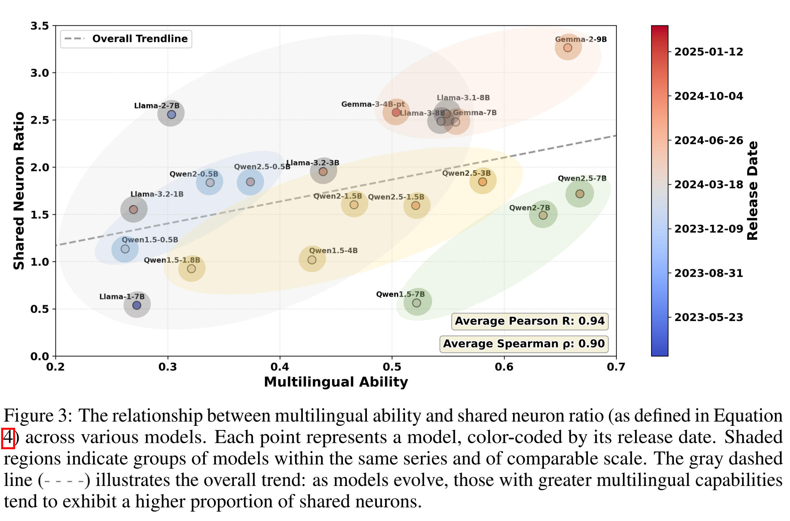
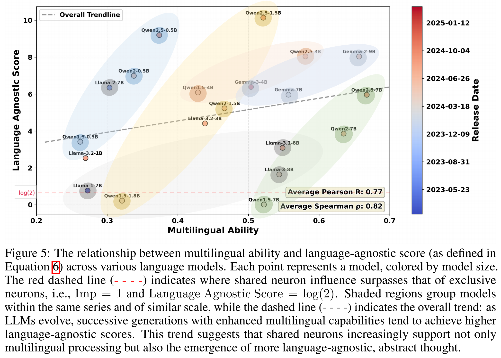
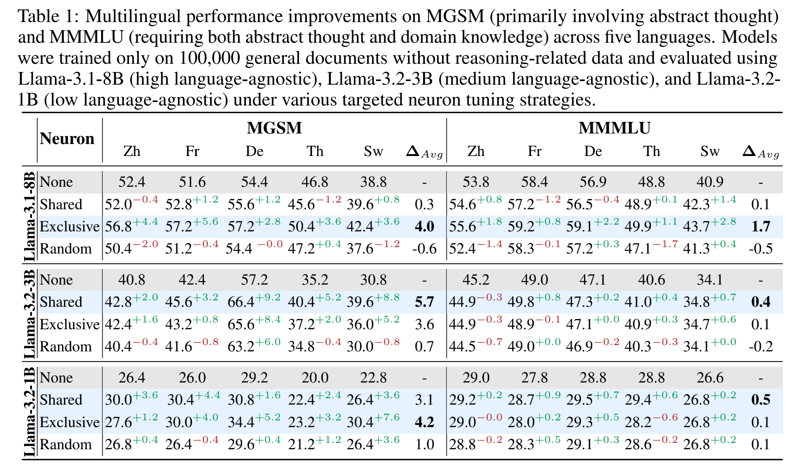

<div align=center>
<!-- <h1>Avatar: Agent-based Virtual Approach to Large Scale Recommendation Simulation</h1> -->

# The Emergence of Abstract Thought in Large Language Models Beyond Any Language

[](https://huggingface.co/collections/vermouthdky/unnatural-language-67bbdf636dbc3ed024adb478)
[](https://arxiv.org/abs/2503.01926)


<div align=left> 
<p>
In this work, we find that LLMs progressively develop a core language-agnostic parameter space. This compact yet critical set of parameters underlies the model’s ability to generalize beyond individual languages, supporting the emergence of abstract thought that is not tied to any specific linguistic system. 
</p>
<p>
Specifically, we identify language-related neurons—those are consistently activated during the processing of particular languages, and categorize them as either shared (active across multiple languages) or exclusive (specific to one).
</p>
<p>
As LLMs undergo continued development over time, we observe a marked increase in both the proportion and functional importance of shared neurons, while exclusive neurons progressively diminish in influence.
</p>
</div>




<div align=left> 
<p>
Motivated by these insights, we propose neuron-specific training strategies tailored to LLMs' language-agnostic levels at different development stages.
</p>
</div>


</div>

<p id="Catalogue"></p>  

## 📋 Catalogue 

- [Catalogue](#Catalogue)
- [Preparations](#Preparations)
- [Dataset](#Dataset)
- [Quick Start](#Quick-Start)

<p id="Preparations"></p>  

## ⚙️ Installation

<!-- ### Step 1. Install requirements.txt -->
Set up a virtualenv and install the [pytorch](https://pytorch.org/get-started/previous-versions/) manually. After that, install all the dependencies listed in the `requirements.txt` file by running the following command:

```bash
pip install -r requirements.txt
```
Our experiments have been tested on **Python 3.9.7 with PyTorch 2.2.2+cu117**.


## 📚 Datasets
Download dataset from following links:
| Dataset | Description | 🤗 Download |
|--------------|---------------|-----|
| Detection | Comprises 1000 sentences per language across 6 languages from OSCAR dataset, used for identification of language-related neurons. | [Link](https://huggingface.co/datasets/Chen1999/Detection) |
| Training | A multilingual corpus with at least 100k samples per language from CulturaX, MADLAD, and Wikipedia, used for targeted neuron pretraining. | [Link](https://huggingface.co/datasets/Chen1999/Training) |
| Evaluation | 	Includes MMMLU and MGSM datasets for measuring multilingual performance on high-, medium-, and low-resource languages. | [Link](https://huggingface.co/datasets/Chen1999/Evaluation) |

<p id="Quick-Start"></p> 

## ⌛️ Quick Start

After placing data in the ./dataset folder, you can run the following scripts to replicate key stages of our pipeline:

By running the following command, you will **detect language-related neurons** across multiple languages in a given LLM:
```bash
bash detection.sh
```

By running the following command, you will **deactivate language-specific neurons** and obtain a modified LLM variant:
```bash
bash deactivation.sh
```

By running the following command, you will **pretrain the LLM with language-specific data** to enhance its performance in that language:
```bash
bash train.sh
```


## 📊 Enhancement Results



## 📖 Citation

If you find our repo useful, please consider citing
```bibtex
@misc{chen2025abstractthought,
      title={The Emergence of Abstract Thought in Large Language Models Beyond Any Language}, 
      author={Yuxin Chen and Yiran Zhao and Yang Zhang and An Zhang and Kawaguchi Kenji and Shafiq Joty and Junnan Li and Tat-Seng Chua and Michael Qizhe Shish and Wenxuan Zhang},
      year={2025},
      eprint={2506.xxxxx},
      archivePrefix={arXiv},
      primaryClass={cs.CL},
      url={https://arxiv.org/abs/2506.xxxx}, 
}